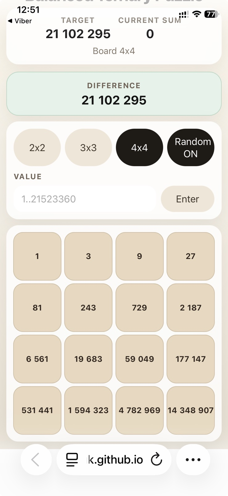

# Balanced Ternary Puzzle

A small web puzzle game built around balanced ternary numbers. Adjust the board, compare the current sum with the target, and solve each layout with the right moves.

## Screenshots

| Mobile layout |
| --- |
|  |

## Run locally

```bash
npm install
npm run dev
```

## Live Launch

Pages link will be added separately.
